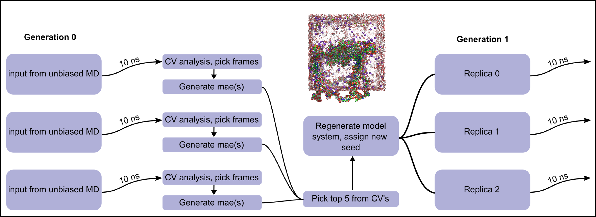

<h2 align="center">
DNA <em>"SWARM"</em> SIMULATIONS
</h2>

<p align="center">
 <em>Dillon McCarthy / 2022</em>
</p>

## Contents
<!--- a tab is needed after every entry in this contents list because it wont put the next item on a new line otherwise -->
1 - [Introduction](#1-introduction)   
&nbsp;&nbsp;&nbsp;1.1 - [General Workflow](#11-general-workflow)   
&nbsp;&nbsp;&nbsp;1.2 - [Considerations](#12-considerations)   
&nbsp;&nbsp;&nbsp;1.3 - [Requirements](#13-requirements)   
2 - [Introduction](#1-running-the-shotgun-simulations)    
&nbsp;&nbsp;&nbsp;2.1 - [Code Overview](#21-code-overview)

3 - [Tests/Verification](#3-testsverification)


---
### 1. Introduction
The motivation of the stuff goes here...
hmmm<br>
yea.........

need to fill this out
#### 1.1 General Workflow


#### 1.2 Considerations
#### 1.3 Requirements

### 2. Running the Shotgun Simulations
#### 2.1 Code Overview
#### 2.2 Collective Variables

### 3. Tests/Verification
 - [x] Check frames returned vs original simulation\
    In the analysis of generation <**i**>, you will return the top 5 structures of that generation (**G<sub>i</sub>**) to be used as the starting structures for the next generation **G<sub>i+1</sub>**. To ensure that these are the correct frames, the five newly generated cms structures were loaded into VMD and compared to the corresponding frame of the replica they were supposedly derived from. The structures matched up and were therefore valid. For example, if generation 0, replica 1 gave the best "structure" at frame 222, the cms generated from this frame was compared to the structure found on frame 22 of generation 0 replica 1.[^1]
 - [x] Swap cms/trj for dehydrated dms/dcd\
    Using the cms/trj for trajectory analysis is ***incredibly*** slow. Trajectories were instead dehydrated using VMD, and then passed through the CV analysis. These results were compared against the original method[^2] to ensure they returned the same result.
 - [&cross;] Create Script to load in top trajectories (sliced?) to show the full pathway of the simulation in VMD
    - [&cross;] Figure out how to load in VMD with pre-defined settings using the .vmd script.
    - [&cross;] python script to generate .vmd given custom inputs

 [^1]: Basically, do the indexes line up between actually processing the CV's using VMD and writing the frames using Schr&#246;dinger?
 [^2]: Using the cms/trj as the trajectory input.


NOTE: for the template file, we are basically reading it in, keeping all the lines that have to do with the cms structure (so ignore the mae of the solute and the solvent lines...they dont matter) and replacing them with updated coordinates. HOWEVER, we made need different templates to match the number of atoms in the simulation. if atoms between the template and simulation frame are not equivalent, everything breaks. here is the simple fix:

```
def read_traj():
    atoms, coords, box_size = read_traj(trajectory.frame(i))
    if atoms == atomcount_1:
        template = 'template_1'
    if atoms == atomcount_2:
        template = 'template_2'
    if atoms == atomcount_3:
        template = 'template_3'

    return template, coords, box_size
```

this way, you just choose a template that matches the number of atoms at that frame. I actually dont need to do this but it would still work.


for the shell script stuff:
need to launch the dispdev vmd command from a SEPARATE bash file because you need the first one for the /dev/null output to suppress vmd, because the nohub command doesnt work from python, so python needs to launch a shell script, which in turn, launches another shell script.

so i have two bash files. main.py calls submit_vmd_main.sh, which spawns all the individual processes from submit_vmd_sub.sh. Is there a cleaner way to do this? probably, but i dont care

also doing it this way ensures that the bash script (submit_vmd_main) called by main.py always stays within the same directory, because it spawns off other bash processes which change directory. This means I dont have to worry about switching between a bunch of things all the time


### 4. Markov State Model
This section will explain how to run the markov state model scripts for Analysis.

#### 4.1 Reading in Data
to begin, call readin_replicas.py's function to read in the data for **all** simulations.

start in the main directory, where you see folders [gen_x0, gen_x1, gen_x2...gen_xn]. Other folders may exist here so long as they dont share the same gen_<number> nomenclature.
